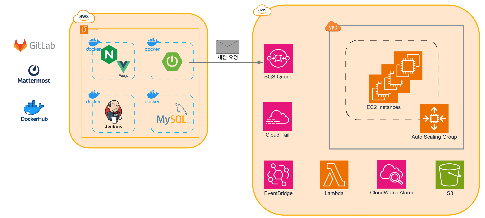
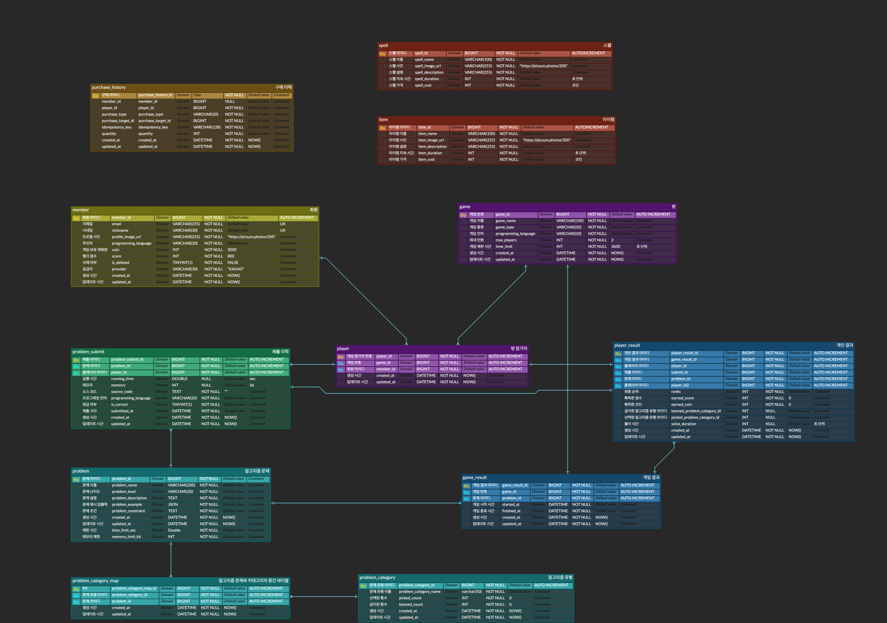

## 프로젝트 소개

**“League Of Algo Logic”** 은 알고리즘 문제 풀이를 실시간으로 경쟁하는 게임형 코딩 플랫폼입니다.

### 시연 영상
[시연 영상 바로가기](https://www.youtube.com/embed/xVvO6uCgJ6o)

---

## 프로젝트 개요

- **소셜 로그인** (카카오 OAuth) 지원
- **게임 기능**: 방 생성 → 대기실 → 밴/픽 선택 → 아이템 및 스펠 구매 → 코드 배틀 및 채점 → 결과
- **마이페이지**: 프로필, 티어, 통계, 대전 기록 제공
- **실시간 상호작용**: STOMP WebSocket 기반 채팅/알림

---

## 기능 설명

### 🏆 티어 제도

플레이어의 점수(`score`)에 따라 아래의 티어로 분류됩니다.  
각 티어는 승리/패배 결과에 따라 점수가 변동되며, 단계별로 구간이 존재합니다.

| 아이콘 | 티어 | 구간 (Division) | 점수 범위 |
| --- | --- | --- | --- |
|  | **Bronze** | V / IV / III / II / I | 300 ~ 799 |
|  | **Silver** | V / IV / III / II / I | 800 ~ 1299 |
|  | **Gold** | V / IV / III / II / I | 1300 ~ 1799 |
|  | **Platinum** | V / IV / III / II / I | 1800 ~ 2299 |
|  | **Diamond** | V / IV / III / II / I | 2300 ~ 2799 |
|  | **Master** | - | 2800 ~ 2999 |
|  | **Grandmaster** | - | 3000 ~ 3199 |
|  | **Challenger** | - | 3200 이상 |


### 💰 보상 제도

게임 종료 후 플레이어는 **점수(Score)**와 **코인(Coin)**을 획득합니다.  
보상은 **게임 유형(일반전/랭크전)** 및 **플레이 결과(정답 제출 여부, 조기종료 여부)**에 따라 달라집니다.

| 게임 유형 | 정답 제출 여부 | 점수 변화 | 코인 획득 |
| --- | --- | --- | --- |
| **일반전 (NORMAL)** | ❌ 미해결 | 0 | 500 |
|  | ✅ 해결 | 0 | 1000 |
| **랭크전 (RANKED)** | ❌ 미해결 | -100 | 500 |
|  | ✅ 해결 | +100 | 1000 |
| **조기종료 (Early Termination)** | ❌ 정답 미제출 | 0 | 0 |
|  | ✅ 정답 제출 | 게임 유형과 동일 | 게임 유형과 동일 |

### 🧮 코드 채점 점수 환산 정책

순위에 반영될 점수는 **정규화와 가중합**을 이용해 계산됩니다.  

- `min-max 정규화`를 통해 각 지표의 범위를 통일합니다.  
- **제출 시간, 실행 시간, 메모리 사용량**을 각각 `5 : 4 : 1`의 비율로 반영합니다.  
- 따라서 제출이 조금 늦더라도 성능이 더 좋으면 높은 등수를 얻을 수 있도록 설계되었습니다.  

#### 환산 공식
$$
S = 5 \cdot T_{norm} + 4 \cdot R_{norm} + 1 \cdot M_{norm}
$$

- $T_{norm}$: 제출 시간 (min-max 정규화 값)  
- $R_{norm}$: 실행 시간 (min-max 정규화 값)  
- $M_{norm}$: 메모리 사용량 (min-max 정규화 값)  

### 🧩 아이템

플레이어가 **코인**을 사용하여 구매할 수 있으며, 상대방에게 해로운 효과를 줍니다.

| 아이콘                                                                                        | 이름     | 설명                                       | 지속 시간 | 비용     |
| ------------------------------------------------------------------------------------------ | ------ | ---------------------------------------- | ----- | ------ |
|  | **해킹** | 상대방의 물리 키보드를 박살내고, **화상 키보드 코딩**을 강제합니다. | 10초   | 500 코인 |
|  | **월식** | 상대방 화면에 **암전 효과**를 줍니다.                  | 10초   | 500 코인 |
|  | **탈진** | 상대방의 **타이핑 속도를 지연**시킵니다.                 | 10초   | 500 코인 |
|  | **지진** | 상대방 화면에 **지진 효과**를 일으킵니다.                | 5초    | 500 코인 |
|  | **점화** | 상대방 에디터에 불을 질러 **코드를 태웁니다.**             | 10초   | 500 코인 |


### ✨ 스펠

플레이어가 **자신에게 유리한 효과**를 얻기 위해 구매할 수 있으며, 스펠은 한 게임당 **1개만 선택**할 수 있습니다.

| 아이콘                                                                                          | 이름      | 설명                               | 지속 시간 | 비용     |
| -------------------------------------------------------------------------------------------- | ------- | -------------------------------- | ----- | ------ |
|  | **보호막** | 5분간, 상대방 아이템 효과를 **1회 무효화**합니다.  | 300초  | 500 코인 |
|  | **정화**  | 현재 자신에게 적용 중인 **모든 아이템 효과 제거**   | 60초   | 800 코인 |
|  | **감시자** | 일정 시간 동안 상대방의 **실시간 화면을 감시**합니다. | 60초   | 500 코인 |

<br>
<br>

## **Tech Specifications**

### 시스템 아키텍쳐


### ERD


---

## Project Skill Stack Version

### BE

| **Skill** | **Version** |
| --- | --- |
| Java | 17 |
| SpringBoot | 3.5.3 |
| AWS SDK | 2.32.9 |
| MySQL | 8.0.42 |
| JJWT | 0.12.6 |

### FE

| **Skill** | **Version** |
| --- | --- |
| Vue.js | 3 |

---

## 빌드 방법

### 1. 백엔드: API-Server
```bash
git clone https://lab.ssafy.com/skwpqjq/c204-be-api.git
cd c204-be-api
cp <env 파일 경로> .env

docker build -t <dockerhub_id>/<image_name>:<tag> .
docker run -d \
  --name <container_name> \
  -p 8081:8081 \
  <dockerhub_id>/<image_name>:<tag>
```

### 2. 백엔드: Judge-Server
```bash
git clone https://lab.ssafy.com/skwpqjq/c204-be-judge.git
cd c204-be-judge
cp <env 파일 경로> .env

./gradlew clean build
java -jar -Dspring.profiles.active=prod c204-be-judge-0.0.1-SNAPSHOT.jar
```

### 3. 프론트엔드
```bash
git clone https://lab.ssafy.com/rudrn0110/c204-fe.git
cd c204-fe/fe
cp <env 파일 경로> .env.production

docker build -t <dockerhub_id>/<image_name>:<tag> .
docker run -d \
  --name <container_name> \
  -p 80:80 \
  -p 443:443 \
  <dockerhub_id>/<image_name>:<tag>
```

## **배포 시 특이사항 및 배포 방법**

1. 알고리즘 채점 서버는 **별도의 EC2 인스턴스**에서 배포되었음
2. 알고리즘 채점 서버의 원활한 동작을 위해 지정된 위치에 아래 유형의 디렉토리를 미리 생성하여야 함.
    - 사용자의 소스코드`(/home/ubuntu/sourceCode)`
    - 채점에 사용될 테스트케이스`(/home/ubuntu/testcases)`
    - 메타 파일`(/home/ubuntu/c204-be-judge/meta)`
3. 알고리즘 채점 서버는 **ubuntu 환경**에서만 동작함
4. AWS 서비스 환경은 사전에 구성되어야 하며, 다음 리소스를 포함합니다.
    - S3, SQS
```bash
#MySQL
docker pull mysql:8.0.42

docker run -d \
	--name mysql \
	-e MYSQL_ROOT_PASSWORD=1q2w3e4r! \
	-e MYSQL_DATABASE=lol \
	-p 3306:3306 \
	mysql:8.0.42

#FRONT-END
docker pull nove1080/c204-fe

docker run -d \
	--name c204-fe \
	-p 80:80 \
	-p 443:443 \
	nove1080/c204-fe:latest

#BACK-END: API-SERVER
docker pull nove1080/c204-be-api

docker run -d \
	--name c204-be-api \
	-p 8081:8081 \
	nove1080/c204-be-api:latest
	
#BACK-END: JUDGE-SERVER
sudo apt update
sudo apt install openjdk-17-jdk
sudo apt install g++

sudo mkdir -p /etc/apt/keyrings
curl https://www.ucw.cz/isolate/debian/signing-key.asc | sudo tee /etc/apt/keyrings/isolate.asc > /dev/null
echo "deb [arch=amd64 signed-by=/etc/apt/keyrings/isolate.asc] http://www.ucw.cz/isolate/debian/ bookworm-isolate main" | sudo tee /etc/apt/sources.list.d/isolate.list
sudo apt update
sudo apt install isolate

git clone https://lab.ssafy.com/skwpqjq/c204-be-judge.git
cd c204-be-judge
cp <env 파일 경로> .env

./gradlew clean build

java -jar -Dspring.profiles.active=prod c204-be-judge-0.0.1-SNAPSHOT.jar
```